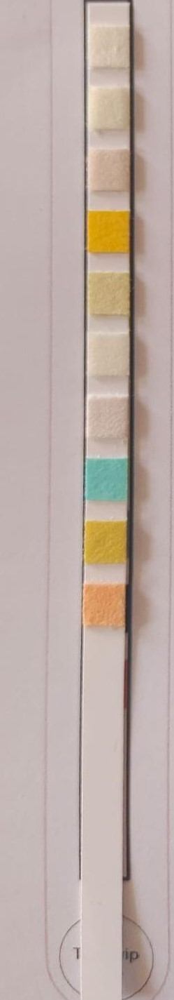
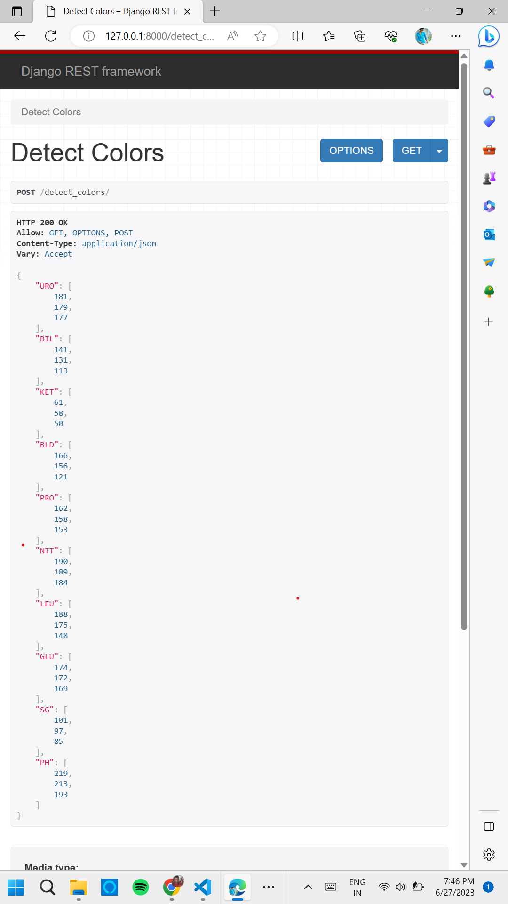

# color-detection.github.io
<h3>This is a application which we can use for detecting the colors from a urine strip(refer images folder) made with python <q>opencv</q> module</h3>
<h2>Input:</h2>

<h2>Output:</h2>

 
 

